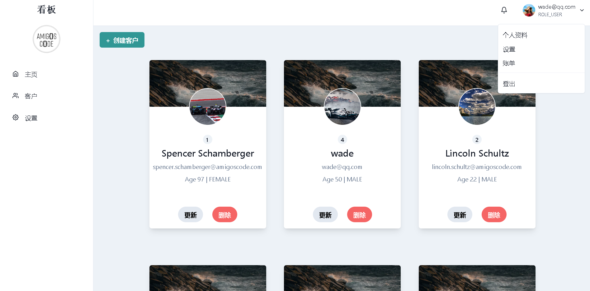
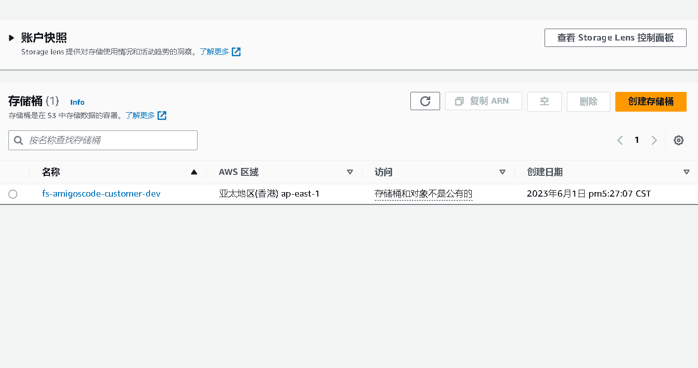

# SpringBoot,React.js&AWS

- 后端
    - 技术栈
        - docker
            - 运行
                
                在docker-compose.yml  目录下
                
                docker-compose up -d
                
            - 格式规范
                
                ```bash
                export FORMAT="ID\t{{.ID}}\nNAME\t{{.Names}}\nIMAGE\t{{.Image}}\nPORTS\t{{.Ports}}\nCOMMAND\t{{.Command}}\nCREATED\t{{.CreatedAt}}\nSTATUS\t{{.Status}}\n”
                ```
                
            - 在容器中运行命令
                
                ```bash
                docker exec -it postgres sh
                ```
                
                - 具体来说，命令中的各个部分的含义如下：
                    - **`docker exec`**：这是 Docker 命令行工具的一部分，用于在正在运行的容器中执行命令。
                    - **`it`**：这是两个选项的组合，用于以交互式终端模式运行命令。 **`i`** 选项使得命令保持与终端的交互性，**`t`** 选项则为命令分配一个伪终端。
                    - **`postgres`**：这是容器的名称或容器 ID，表示要在其中执行命令的目标容器。在这种情况下，它是一个 PostgreSQL 容器。
                    - **`sh`**：这是要在容器中执行的命令。在这个例子中，它是一个简单的 "sh" 命令，它启动一个 Shell（通常是 Bourne Shell）会话。
                    - 综上所述，**`docker exec -it postgres sh`** 命令将在名为 "postgres" 的 PostgreSQL 容器中启动一个交互式 Shell 会话，使你能够在容器中执行命令和操作。
        - postgres
            - 连接到特定数据库
                
                ```bash
                psql -U amigoscode -d postgres
                ```
                
                - 具体来说，命令中的各个部分的含义如下：
                    - **`psql`**：这是 PostgreSQL 提供的一个交互式终端工具，用于与 PostgreSQL 数据库进行交互。
                    - **`U amigoscode`**：这是 psql 命令的一个选项，用于指定要连接到数据库的用户名。在这个例子中，用户名是 "amigoscode"。
                    - **`d postgres`**：这是 psql 命令的另一个选项，用于指定要连接的数据库名称。在这个例子中，数据库名称是 "postgres"。
                    
                    综上所述，**`psql -U amigoscode -d postgres`** 命令将使用 psql 工具连接到 PostgreSQL 数据库，并使用 "amigoscode" 用户身份连接到名为 "postgres" 的数据库。这将打开一个交互式终端会话，允许你在数据库中执行 SQL 查询和操作。
                    
            - 连接到数据库后的常用操作
                
                ```bash
                \l :显示所有数据库
                \c A : 切换到数据库A
                \d:  显示describ该数据库的所有表
                \x:  expanded display on
                ```
                
            - ctrl+d : 退出
        - 同时使用jpa ,jdbc
        - AWS SDK  for Java  (S3)
            - pom.xml
                
                ```xml
                	
                				<dependency>
                            <groupId>software.amazon.awssdk</groupId>
                            <artifactId>s3</artifactId>
                            <version>2.20.26</version>
                        </dependency>
                ```
                
            - 本地运行环境要有凭证
                
                `%USERPROFILE%\.aws\config`
                
                `%USERPROFILE%\.aws\credentials`
                
            - s3Client
                
                ```java
                @Configuration
                public class S3Config {
                
                    @Value("${aws.region}")
                    public String awsRegion;
                    @Bean
                    public S3Client s3Client(){
                        S3Client client = S3Client.builder()
                                .region(Region.of(awsRegion))
                                .build();
                        return client;
                    }
                }
                ```
                
            - putObject
                
                ```java
                public void putObject(String bucketName,String key,byte[] file){
                        PutObjectRequest objectRequest = PutObjectRequest.builder()
                                .bucket(bucketName)
                                .key(key)
                                .build();
                
                        s3Client.putObject(objectRequest, RequestBody.fromBytes(file));
                    }
                ```
                
            - getObject
                
                ```java
                public byte[] getObject(String bucketName,String key ){
                        GetObjectRequest getObjectRequest = GetObjectRequest
                                .builder()
                                .bucket(bucketName)
                                .key(key)
                                .build();
                        ResponseInputStream<GetObjectResponse> res= s3Client.getObject(getObjectRequest);
                
                        try {
                            return res.readAllBytes();
                        } catch (IOException e) {
                            throw new RuntimeException(e);
                        }
                    }
                ```
                
        - jpa repository
            
            ```java
            @Modifying
                @Query(" UPDATE Customer c SET c.profileImageId =?1 WHERE c.id=?2")
                int updateProfileImageId(String profileImageId,Integer customerId);
            ```
            
    - 学习
        - aws s3
            
            Amazon Simple Storage Service (Amazon S3) 是一种对象存储服务，提供行业领先的可扩展性、数据可用性、安全性和性能。各种规模和行业的客户可以为几乎任何使用案例存储和保护任意数量的数据，例如数据湖、云原生应用程序和移动应用程序。借助高成本效益的存储类和易于使用的管理功能，您可以优化成本、组织数据并配置精细调整过的访问控制，从而满足特定的业务、组织和合规性要求。
            
            
            
        - @Configuration
            
            这样可以直接访问app.yml中的配置
            
            ```java
            @Configuration
            @ConfigurationProperties(prefix = "aws.s3.buckets")
            public class S3Buckets {
                public String getCustomer() {
                    return customer;
                }
            
                public void setCustomer(String customer) {
                    this.customer = customer;
                }
            
                public String customer;
            
            }
            ```
            
        - java  也可以用var
        - DTO & DAO
            
            DTO（Data Transfer Object）和DAO（Data Access Object）是在软件开发中常见的两个概念，它们分别用于不同的目的。
            
            1. DTO（Data Transfer Object）：
                - DTO 是一种数据传输对象，用于在不同层或组件之间传输数据。
                - DTO 通常是一个简单的数据容器，用于封装需要传输的数据字段和对应的访问方法（getter 和 setter）。
                - DTO 的设计目的是以最小的开销和复杂性来传输数据。
                - DTO 用于解决不同层或组件之间的数据传输问题，可以隐藏底层实现细节，减少网络开销，并解决版本兼容性问题。
            2. DAO（Data Access Object）：
                - DAO 是一种数据访问对象，用于封装对数据源的访问和操作。
                - DAO 提供了一组抽象的接口或方法，用于执行对数据源的常见操作，如增删改查（CRUD）。
                - DAO 的设计目的是将数据访问逻辑与业务逻辑分离，提供统一的数据访问接口。
                - DAO 可以隐藏底层数据库的实现细节，提供更高级别的数据操作方法，使业务层能够以更简洁和高层次的方式进行数据访问。
        - JDBC & JPA
            
            JDBC（Java Database Connectivity）和 JPA（Java Persistence API）是 Java 中用于与数据库进行交互的两个重要技术。
            
            1. JDBC（Java Database Connectivity）：
                - JDBC 是 Java 提供的一组用于与关系型数据库进行交互的 API。
                - 通过 JDBC，开发人员可以使用 Java 代码来连接、执行 SQL 语句、处理结果集等与数据库相关的操作。
                - JDBC 提供了一套标准的接口，开发人员需要手动编写与数据库交互的代码，包括建立数据库连接、创建和执行 SQL 语句、处理结果集等。
                - JDBC 直接面向数据库，需要开发人员手动处理 SQL 语句和数据库连接等细节。
            2. JPA（Java Persistence API）：
                - JPA 是 Java 提供的一套对象关系映射（ORM）规范，用于简化应用程序与数据库之间的交互。
                - JPA 提供了一种面向对象的方式来进行数据库访问，将数据库表和 Java 对象进行映射，通过操作 Java 对象来间接操作数据库。
                - JPA 隐藏了底层数据库的细节，开发人员可以通过定义实体类、注解和配置文件来描述数据库表和关系，而不需要手动编写 SQL 语句。
                - JPA 提供了一系列的API和查询语言（如JPQL），使开发人员能够进行常见的数据库操作，如插入、更新、删除和查询等。
        - 三引号
            
            使用了三引号 **`"""`** 来定义多行字符串。三引号允许在字符串中包含多行文本，而不需要使用转义字符或换行符。
            
        - String.isBlank & isEmpty
        - servlet & springboot
            
            Servlet 和 Spring Boot 是相关但不同的概念。
            
            Servlet 是 Java 技术的一部分，用于开发基于服务器的 Web 应用程序。Servlet 是在服务器端执行的 Java 类，用于处理客户端发送的请求并生成响应。它提供了处理动态内容、生成 HTML 页面、访问数据库、进行身份验证和授权等功能。Servlet 是 Java Web 开发的核心组件之一。
            
            Spring Boot 是一个用于创建和部署独立、生产级别的 Spring 应用程序的框架。它简化了 Spring 应用程序的开发过程，并提供了自动配置、约定优于配置、快速开发等特性。Spring Boot 构建在 Spring 框架之上，利用了 Spring 的各种功能和模块。
            
            在 Spring Boot 中，Servlet 是一种可以使用的技术。Spring Boot 内置了嵌入式的 Servlet 容器（如 Tomcat、Jetty 等），可以直接在应用程序中使用 Servlet 技术。开发人员可以编写 Servlet 类，并将其注册为 Spring Boot 应用程序的一部分，以处理请求和生成响应。
            
            Spring Boot 提供了 Spring MVC 框架，它是基于 Servlet 的 Web 框架，用于处理 Web 请求和构建 RESTful API。Spring MVC 使用 Servlet 技术作为底层实现，但提供了更高级的抽象和功能，使开发人员可以更轻松地构建 Web 应用程序。
            
            因此，Servlet 是一种底层的 Java 技术，而 Spring Boot 是一个构建在 Servlet 之上的框架，用于简化和加速 Java Web 应用程序的开发过程。Spring Boot 提供了与 Servlet 相关的功能和集成，但也扩展了更多的功能和特性，使开发人员能够更便捷地开发现代化的 Web 应用程序。
            
        - jwt
            
            JWT（JSON Web Token）是一种用于在网络应用之间安全传递信息的开放标准（RFC 7519）。它是一种紧凑的、自包含的方式，用于在用户和服务器之间传递认证和授权信息。
            
            JWT由三部分组成：头部（Header）、载荷（Payload）和签名（Signature）
            
        
- 前端
    - 技术栈
        
        react
        
    - npm包
        
        react-dropzone
        
    - 学习
        - jwtDecode
            
            **`jwtDecode`**是一个用于解码 JSON Web Token (JWT) 的 JavaScript 库。JWT 是一种用于在不同系统之间安全传输信息的令牌。它由三部分组成：头部（Header）、载荷（Payload）和签名（Signature）。
            
            **`jwtDecode`** 库允许您将 JWT 令牌解码为一个 JavaScript 对象，以便查看和提取其中的信息。通过解码 JWT，您可以获得令牌中包含的用户身份、角色、权限等信息，以便进行身份验证和授权。
            
- 学习
    - CI/CD
        
        CI/CD (Continuous Integration/Continuous Delivery) 是一种软件开发实践，旨在通过自动化和持续集成来提高软件交付的速度、质量和可靠性。
        
        CI（持续集成）是指将团队成员的代码变更频繁地合并到主干代码库中，并使用自动化构建和测试工具来验证代码的正确性。CI 的目标是尽早发现和解决代码集成问题，减少集成延迟和冲突，并提高团队协作效率。
        
        CD（持续交付/持续部署）是在 CI 的基础上进一步扩展，指的是自动化地将经过验证的代码交付到生产环境中。CD 的目标是缩短软件交付的周期，降低发布的风险，实现快速、可靠的软件发布。
        
        CI/CD 流程通常包括以下步骤：
        
        1. 代码管理：使用版本控制系统（如Git）管理代码，并将代码库作为团队的主干代码库。
        2. 持续集成：团队成员频繁地提交代码变更到主干代码库，并使用自动化构建工具（如Jenkins、Travis CI）对代码进行编译、测试和静态代码分析。
        3. 自动化测试：编写自动化测试用例，包括单元测试、集成测试和端到端测试，确保代码的正确性和稳定性。
        4. 构建和打包：将代码编译成可执行的软件包，并生成部署所需的配置文件和文档。
        5. 部署到测试环境：将构建好的软件包部署到测试环境中，并运行更全面的测试，包括回归测试、性能测试等。
        6. 自动化部署：将经过测试的代码自动部署到生产环境中，可以使用工具如Ansible、Docker、Kubernetes等来实现自动化部署。
        7. 监控和反馈：监控生产环境中的应用性能、稳定性和用户反馈，及时发现和解决问题，并反馈给开发团队进行改进。
        
        CI/CD 的好处包括减少人工错误、提高开发效率、加快交付速度、降低发布风险、增强软件质量和稳定性等。它适用于各种软件开发项目，特别是在敏捷开发、DevOps 等快速迭代和频繁发布的环境中更加重要。
        
        要实施 CI/CD，你需要选择适合的工具和技术栈，并建立适合你团队和项目需求的自动化流程。常见的工具和平台包括Jenkins、Travis CI、GitLab CI/CD、GitHub Actions等。你还需要编写合适的测试用例、配置自动化构建和部署流程，并确保团队成员具备相关的技能和知识。
        
        总之，CI/CD 是现代软件开发中的关键实践，可以帮助团队提高开发效率、软件质量和交付速度，从而更好地满足用户需求并保持竞争优势。